# HKUST VisLab Coding Challenges

This is a series of coding challenges of HKUST VisLab. I finished level 1, level 2, level 3, level 4, part of level5 (the model is still need yo be updated).

## Level 1 & Level 2 

Both Level 1 and Level 2 implement heatmaps. I originally wanted to use python to implement them. When I did the attention mechanism in the previous paper, I also drew the akin heatmap. But I found that the click switch operation is a bit difficult to implement in python, so I wrote it honestly in JS.

This is the first time I code JS in two years. So it took a lot of time to check package and documentation. The previous full-stack project can refer to [Pokemon](https://github.com/martyLY/pokemon "Pokemon") and [Weibo](https://github.com/martyLY/weibo "miniWeibo").

Level 1 need to draw a Matrix View。

-  The maximum temperature of Hong Kong from 1997 to 2017 by month: 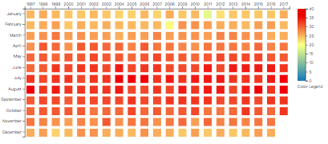

- The minimum temperature of Hong Kong from 1997 to 2017 by month: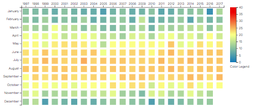

Level 2 needs to be improved on the basis of Level 1, adding a line chart of monthly temperature changes. I also added a button to switch the color of the box based on the highest or lowest temperature of the month.

- The minimum temperature of Hong Kong from 2008  to 2017 by month plus line chart in each month. 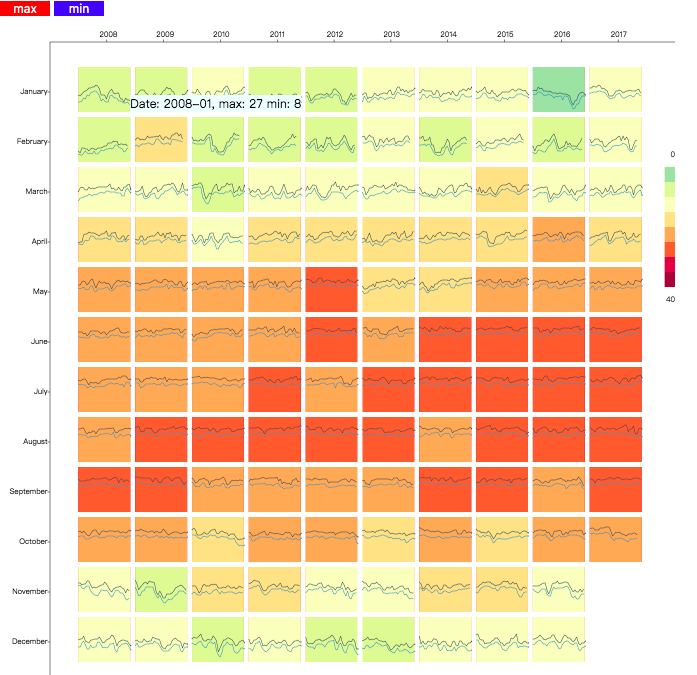

- The maximum  temperature of Hong Kong from 2008  to 2017 by month plus line chart in each month. 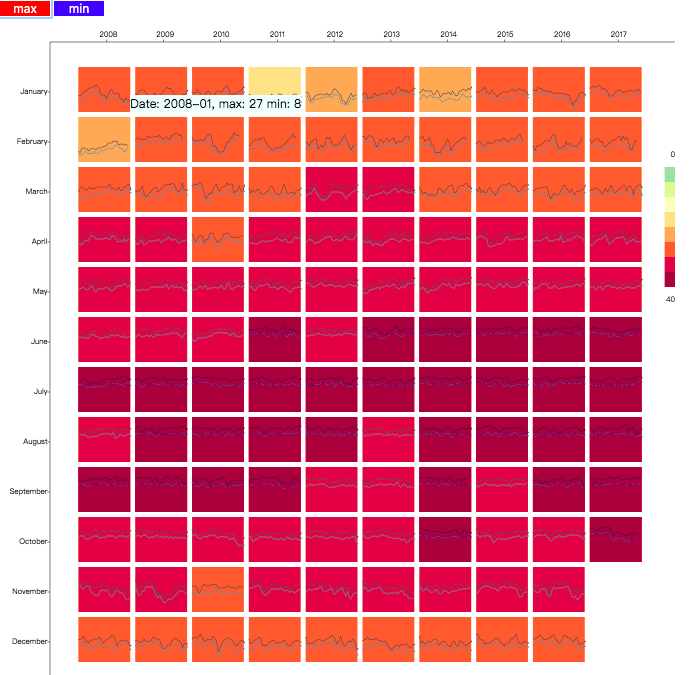

## Level 3

Level 3 need to visualize the collaboration relationship between researchers, a node-link diagram and a matrix is needed. The two separate parts are easy to complete, but the linking of the two parts and animations is a bit difficult for me, which need to advance the use of D3.js.

- For the node-link diagram, the nodes indicate professors and the edges indicate collaborations. The radii of nodes represent the total number of collaborators of each professor.

- For the matrix view, the x and y direction indicate professors, and cells indicate the corresponding collaborations: 

  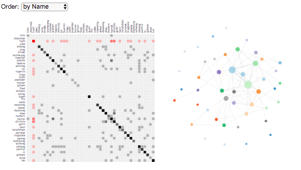

- Click the node in the node-link diagram, the corresponding professor in the matrix would turn to be red: 

  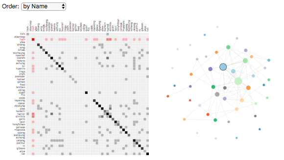

- You can also change the sort by frequency in matrix:

  

## Level 4

Level 4 need to visualize and analysis on Spotify's Worldwide Daily Song Ranking music streaming data.

- First, list the top 10 tracks in the global throughout year 2017 with their total stream counts. 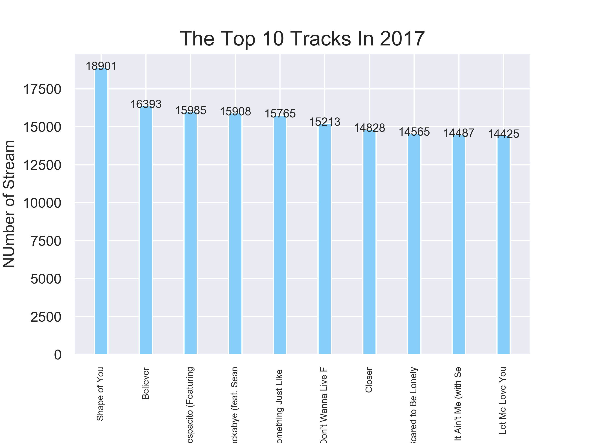

- Second, list the top 10 artists (or groups) those has the most stream counts for all their tracks combined, with the stream counts of each of their tracks. 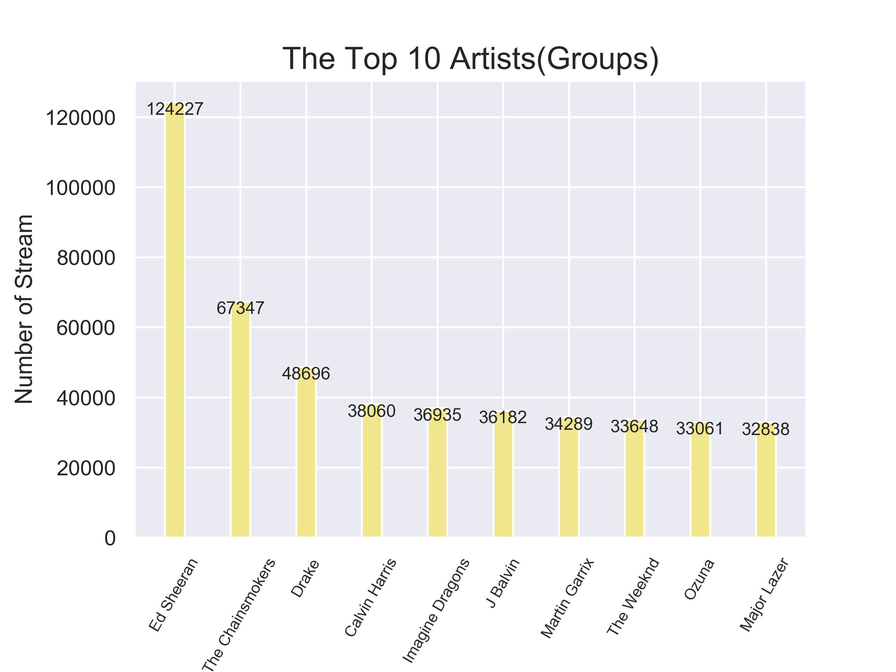 From this bar chart we can find that Ed Sheeran is a well-deserved Rock Star. Even in the Top 10, he has a large share, but how big is this share? 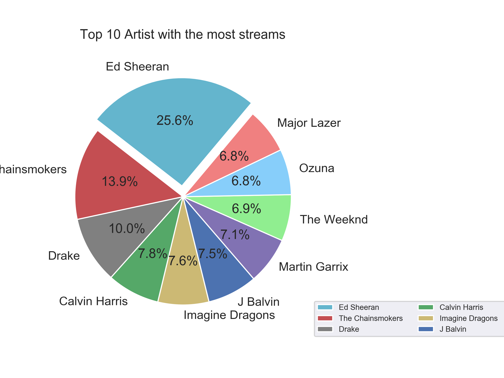

  We can find that Ed Sheeran's streams accounts for almost a quarter of the top 10 singers' streams.

- Then list the top 10 tracks in December, 2017 for each continent (North America, Europe, Asia, South America, Oceania). 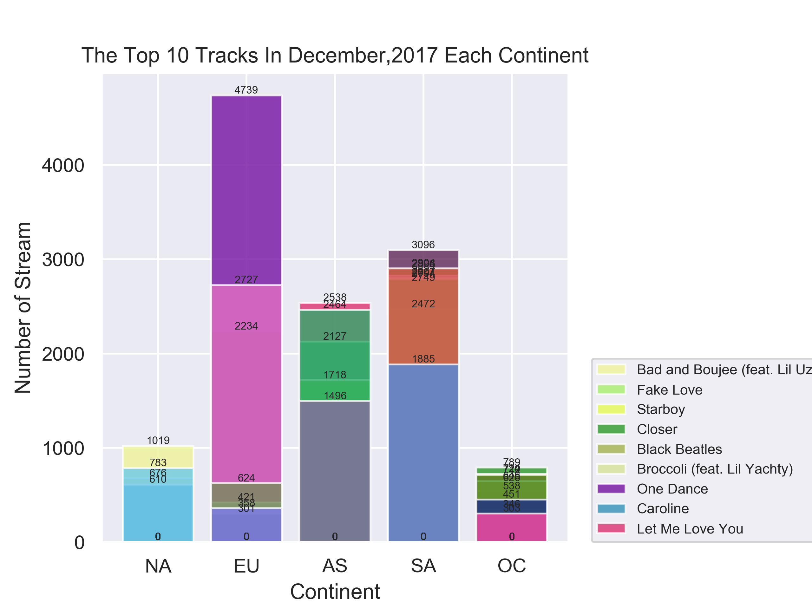 I used overlapping bar charts to find out if the same song would appear on the Top 10 Ranking of each continent, but unfortunately I did not find a song that was popular in every continent.
- Finally, plotting the ranking changes of the Ed Sheeran's "Shape of You" alongside with the stream count changes.  At the beginning I chose one day as a unit and analyzed the ranking changes of the Ed Sheeran's "Shape of You" alongside with the stream count changes. But as shown in the figure, the change curve is not smooth enough to make a proper judgment. So I should use one month as a unit later:  This change curve is much smoother, here I find the number of streams reach to peak in March, and the ranking is also the No. 1.

## Level 5

The task is joining the [Dogs vs. Cats](https://www.kaggle.com/c/dogs-vs-cats-redux-kernels-edition) competition in Kaggle. This is a typical binary classification problem, you can get an ideal accuracy rate by building a classic VGG network. Details about data preprocessing and model building and training can be viewed in [notebook](level5/cat&dog.ipynb) and [cede](level5/model.py).

Because there is no GPU available, and my computer's memory is also limited, here is just a training results with a training set of only 2,000 pictures: 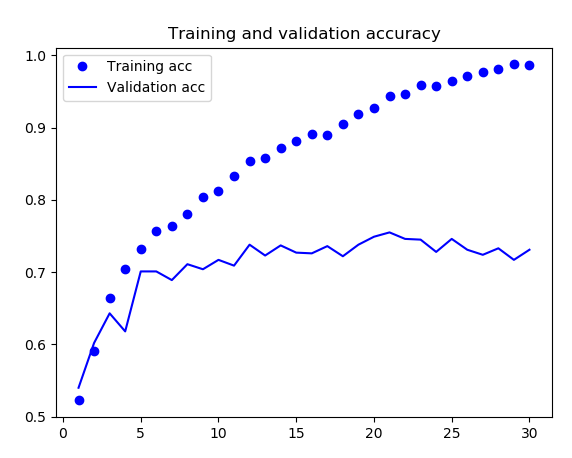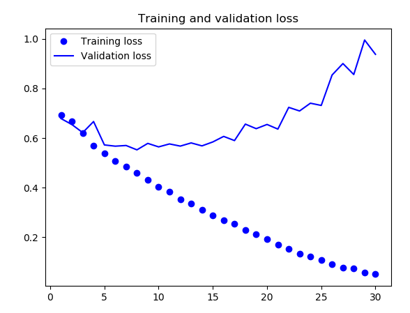

The biggest feature of the training curve is overfitting. Later I thought of using a pre-trained network and slowly data augmentation to solve this problem.

##  About

The original of coding training is in [[HKUST-VISLab](https://github.com/HKUST-VISLab)/**[coding-challenge](https://github.com/HKUST-VISLab/coding-challenge)**].

Please tolerate some code in level1, level2 and level3 not well organized, if you have any suggestions or questions, please do not hesitate take issues to me.

